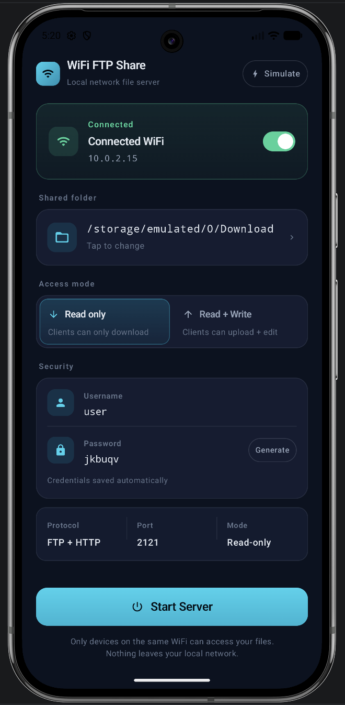
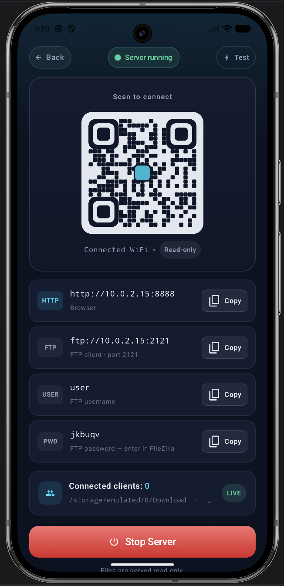

# BetterWiFiFTP

**Android app that turns your phone into a local FTP & HTTP file server over Wi-Fi.**

[](https://play.google.com/store/apps/details?id=com.smhabibjr.betterwififtp)
&nbsp;
[](https://smhabibjr.github.io/better-mobile-wifi-ftp-http-server/)

---

## What It Does

Pick a folder, tap **Start Server** — any device on the same Wi-Fi can instantly connect via FTP client or web browser. No internet, no cloud, no accounts.

---

## Screenshots

| Home Screen | Server Running |
|:-----------:|:--------------:|
|  |  |

---

## Key Features

- **Dual protocol** — FTP (port 2121) + HTTP (port 8888) running simultaneously
- **Read / Write modes** — toggle between download-only or full upload/edit access
- **Password protection** — custom credentials with one-tap password generator
- **QR code** — scan to connect instantly, no typing required
- **Zero data collection** — no analytics, no internet calls, everything stays on-device

---

## Tech Highlights

- **Kotlin + Jetpack Compose** — 100% declarative UI, dark navy & cyan theme
- **Custom FTP & HTTP servers** — implemented from scratch over raw Java sockets (no third-party networking library)
- **Kotlin Coroutines** — non-blocking I/O with structured concurrency per client session
- **Android Foreground Service** — server stays alive while the screen is off
- **Published on Google Play** — passed review, live in production

---

## Build

```bash
git clone https://github.com/smhabibjr/better-mobile-wifi-ftp-http-server.git
cd better-mobile-wifi-ftp-http-server
./gradlew assembleDebug
```

Requires Android Studio Hedgehog or newer · Min SDK: Android 8.0 (API 26)

---

## Privacy

No data leaves your device. Full policy: [PRIVACY_POLICY.md](PRIVACY_POLICY.md)

---

#### Connect with me

[](https://facebook.com/smhabibjr) 
[](https://linkedin.com/in/smhabibjr) 
[](https://www.youtube.com/@smhabibjr)
[](https://medium.com/@smhabibjr)
